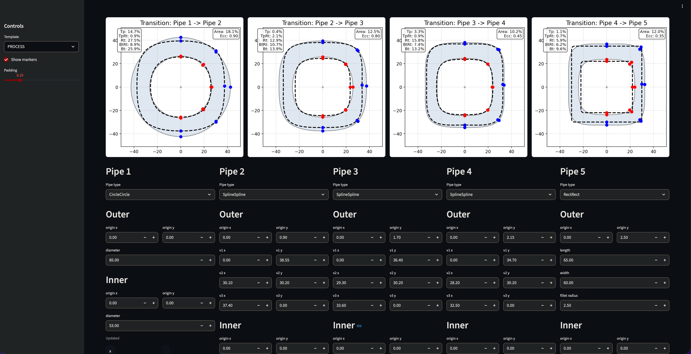

# Drawing Pipe Process Explorer

An interactive geometric library and visualization tool for calculating pipe properties (area, eccentricity, vertex distances, thickness) through a manufacturing process.

## Features

- **Shape Support**: Circle, Rect, Ellipse, and CubicSpline shapes
- **Process Analysis**: Calculate area reductions, eccentricity differences, and thickness reductions between consecutive pipes
- **Interactive Visualization**: View transitions between pipe shapes with real-time metrics
- **Template System**: Pre-built process templates (e.g., PROCESS, FINISH_3, FINISH_6, FINISH_8)
- **Live Editing**: Modify pipe parameters with debounced auto-apply

## Screenshots



## Installation

```bash
# Using uv (recommended)
uv pip install -e .

# Using pip
pip install -e .
```

## Usage

Run the Streamlit app:

```bash
uv run streamlit run streamlit_app.py
```

Or simply:

```bash
uv run streamlit run main.py
```

## Project Structure

```
drawing_pipe/
├── streamlit_app.py     # Main Streamlit UI application
├── main.py              # Entry point
├── pipes.py             # Pipe model definitions (CircleCircle, RectRect, SplineSpline)
├── shapes.py            # Shape models (Circle, Rect, CubicSplineShape)
├── process.py           # Process analysis calculations
├── fixtures.py          # Pre-defined pipe templates
├── visualization/       # Visualization and plotting utilities
└── images/              # Screenshots and assets
```

## Pipe Types

| Type | Outer Shape | Inner Shape | Description |
|------|-------------|-------------|-------------|
| `CircleCircle` | Circle | Circle | Circular pipe cross-section |
| `RectRect` | Rect | Rect | Rectangular pipe with filleted corners |
| `SplineSpline` | CubicSpline | CubicSpline | Complex spline-based profile |

## API Reference

### Shapes (`shapes.py`)

- `Circle`: Defined by `origin` (x, y) and `diameter`
- `Rect`: Defined by `origin`, `length`, `width`, and `fillet_radius`
- `CubicSplineShape`: Defined by `origin` and control points `v1`, `v2`, `v3`

### Pipes (`pipes.py`)

All pipe types support:
- `area`: Cross-sectional area (outer - inner)
- `eccentricity`: Distance between outer and inner origins
- `thickness`: Array of 5 thickness values at key vertices

### Process Analysis (`process.py`)

`ProcessAnalysis` provides:
- `area_reductions`: Percentage area reduction between consecutive pipes
- `eccentricity_diffs`: Change in eccentricity between consecutive pipes
- `thickness_reductions`: Thickness reduction ratios between consecutive pipes

## License

MIT
